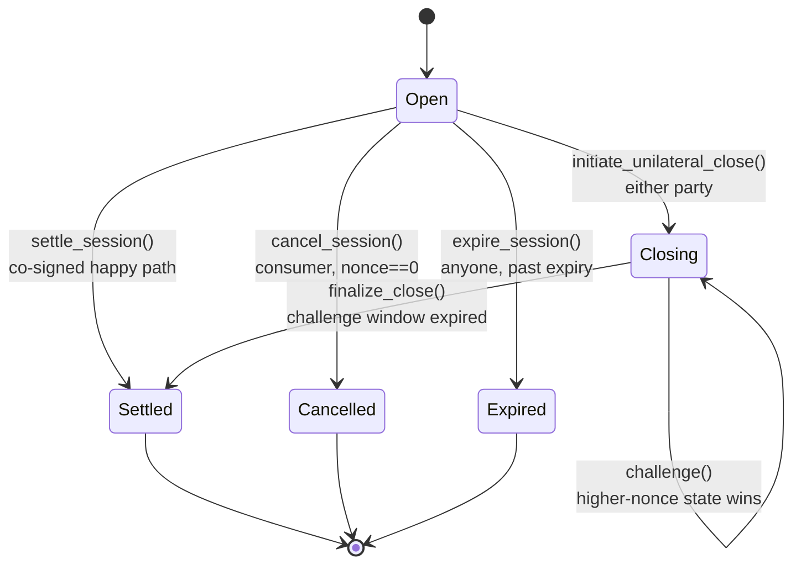
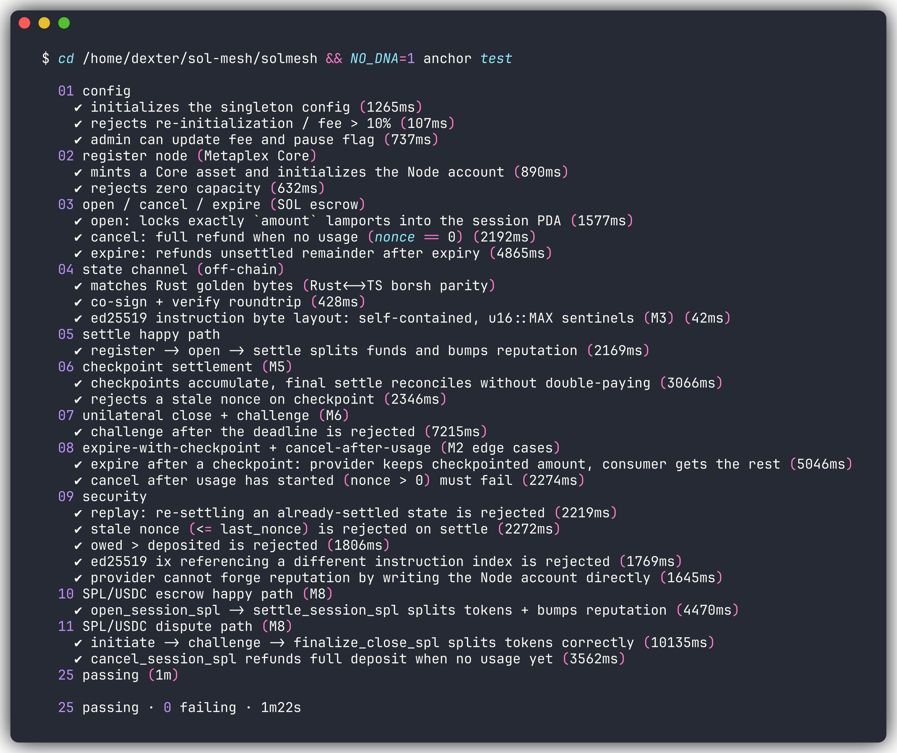

# SolMesh — DePIN State Settler

State-efficient settlement for micro-compute / storage / bandwidth networks on Solana.
Resource usage is metered **off-chain** via signed state channels; only **3 transactions
per session** ever touch the chain. Settlement verifies both parties' Ed25519 signatures
on-chain via the Solana runtime precompile + instructions-sysvar introspection.

> Turbin3 Capstone · Anchor 0.32.1 · Solana 3.x SBF · Metaplex Core 0.12.1

## Deployed Program (Devnet)

```
Program ID: 22RMtywvuM1XDTLpwvKgjP8gfuW1BWq7vDX3gxsTPGMU
Network:    devnet
Anchor:     0.32.1
```

---

## Architecture

```mermaid
flowchart TB
    subgraph OFF["OFF-CHAIN STATE CHANNEL"]
        P[Provider Client]
        C[Consumer Client]
        SU[co-signed StateUpdates<br/>72-byte Borsh messages]
        P <-->|"nonce++, owed+=, units+=<br/>zero gas per tick"| SU
        SU <--> C
    end

    subgraph SHARED["SHARED SCHEMA"]
        ST[<b>solmesh-state</b> crate<br/>StateUpdate{domain, session, nonce,<br/>owed_to_provider, units_consumed, timestamp}<br/>Rust and TypeScript golden-bytes parity]
    end

    subgraph ONCHAIN["ON-CHAIN SOLANA SBF PROGRAM"]
        subgraph INSTRUCTIONS["23 Instructions"]
            IC[initialize_config]
            RN[register_node<br/>mints Core NFT]
            OS[open_session / open_session_spl<br/>locks SOL or USDC into escrow]
            STL[settle_session / checkpoint_settle<br/>verify 2x ed25519, split escrow + fee]
            DS[initiate_unilateral_close / challenge<br/>highest co-signed nonce wins]
            FC[finalize_close / finalize_close_spl<br/>distribute escrow + refund consumer]
            LC[cancel_session / expire_session<br/>refund lifecycle]
            AD[update_config / withdraw_fees / update_node_meta]
        end

        subgraph PDAS["3 PDAs"]
            CFG[Config PDA<br/>singleton: fee_bps, challenge_window,<br/>mpl_core_program, paused]
            NOD[Node PDA<br/>per provider: asset, provider, capacity,<br/>geo, reputation, total_units, active]
            SES[Session PDA<br/>per channel: node, asset, provider, consumer,<br/>mint, deposited, settled_to_provider,<br/>last_nonce, status, vault_bump]
        end

        subgraph SECURITY["SECURITY LAYER"]
            ED[Ed25519 Verification<br/>Solana runtime precompile verifies curve math<br/>SolMesh introspects instructions-sysvar<br/>to prove binding: both sigs on same 72 bytes<br/>Self-contained only: no cross-ix references<br/>Domain-separated: SOLMESH1 prefix]
            CPI[mpl-core CPI<br/>CreateV1: mint Core NFT with Attributes plugin<br/>UpdatePluginV1: refresh reputation<br/>deferred: lamport imbalance in 0.12.1]
        end
    end

    OFF --> SHARED
    SHARED --> INSTRUCTIONS
    INSTRUCTIONS --> PDAS
    PDAS --> SECURITY
```

### Asset Paths

| | SOL Path | SPL Path (USDC) |
|---|---|---|
| Escrow | Lamports in Session PDA | Tokens in vault ATA |
| Lock | `system_program::transfer` | `token::transfer` |
| Payout | `pda_transfer_lamports` | `token::transfer` (signed by vault PDA) |
| Session.mint | `None` | `Some(mint_key)` |

### Session State Machine



---

## User Workflow

```mermaid
flowchart LR
    subgraph S1["1. ADMIN SETUP (once)"]
        IC[initialize_config<br/>authority, fee_bps,<br/>challenge_window]
    end

    subgraph S2["2. PROVIDER ONBOARDING (once per node)"]
        RN[register_node<br/>mint Core NFT<br/>create Node PDA<br/>capacity, geo, reputation]
    end

    subgraph S3["3. CONSUMER OPENS CHANNEL"]
        OS[open_session<br/>lock SOL or USDC into escrow<br/>status=Open, nonce=0]
    end

    subgraph S4["4. OFF-CHAIN STATE CHANNEL"]
        CHANNEL["hundreds of co-signed<br/>StateUpdates flow<br/>nonce goes up, owed goes up, units go up<br/>zero gas"]
    end

    subgraph S5["5. SETTLEMENT"]
        direction TB
        HAPPY["HAPPY PATH<br/>settle_session()<br/>verify 2x ed25519<br/>split escrow + fee<br/>refund consumer<br/>session becomes Settled"]
        DISPUTE["DISPUTE PATH<br/>initiate_unilateral_close()<br/>challenge window 3s+<br/>counterparty posts higher nonce<br/>finalize_close()<br/>session becomes Settled"]
    end

    subgraph S6["6. LIFECYCLE"]
        LC["cancel_session()<br/>no usage, full refund<br/><br/>expire_session()<br/>past expiry, remainder refund"]
    end

    S1 --> S2 --> S3 --> S4 --> S5 --> S6
```



---

## Test Status

```
anchor test -> 25 passing, 0 failing, 1m22s
```



---

## Repository Layout

```
solmesh/
├── Anchor.toml                    # anchor 0.32.1 workspace config
├── Cargo.toml                     # rust workspace (programs/ + crates/)
├── package.json                   # typescript workspace (client/ + app/)
├── MIGRATION.md                   # 0.30.1 to 0.32.1 migration log (11 errors resolved)
│
├── programs/solmesh/              # on-chain anchor program (SBF)
│   └── src/
│       ├── lib.rs                 # entrypoint, 23 instructions
│       ├── state/mod.rs           # Config, Node, Session PDAs (InitSpace)
│       ├── constants.rs           # PDA seeds, bounds, reputation math
│       ├── errors.rs              # 19 custom error codes
│       ├── crypto/ed25519.rs      # instruction-sysvar introspection
│       ├── cpi/core.rs            # mpl-core create_node_asset + set_reputation
│       └── instructions/
│           ├── initialize_config.rs   # singleton Config PDA
│           ├── register_node.rs       # mint Core NFT + Node PDA
│           ├── open_session.rs        # SOL escrow lock
│           ├── settle.rs              # SOL settle + checkpoint
│           ├── dispute.rs             # unilateral close + challenge + finalize
│           ├── lifecycle.rs           # cancel + expire
│           ├── admin.rs               # update config, withdraw fees, node meta
│           ├── spl.rs                 # SPL escrow (Box Account for stack fix)
│           ├── shared.rs              # verify_cosigned_state, pda_transfer_lamports
│           └── mod.rs
│
├── crates/solmesh-state/          # canonical StateUpdate schema (shared Rust-TS)
│   └── src/lib.rs                 # 72-byte borsh, IdlBuild for anchor gen
│
├── client/src/                    # TypeScript SDK
│   ├── sdk.ts                     # SolMesh class, PDA helpers, all 23 instructions
│   └── state.ts                   # sign/verify, ed25519 ix builder, toAnchorArg
│
├── app/                           # Vite + React + wallet-adapter dApp
│
└── tests/                         # anchor mocha integration suite (25 tests)
    ├── 01_config.ts               # 3 tests: init, reject re-init, update
    ├── 02_register_node.ts        # 2 tests: mint Core, reject zero capacity
    ├── 03_open_session.ts         # 3 tests: open, cancel, expire
    ├── 04_state_channel.ts        # 3 tests: golden-bytes, roundtrip, M3
    ├── 05_settle_happy.ts         # 1 test:  register -> open -> settle
    ├── 06_checkpoint.ts           # 2 tests: accumulate, stale nonce
    ├── 07_unilateral_challenge.ts # 1 test:  challenge after deadline
    ├── 08_expire_cancel.ts        # 2 tests: expire+checkpoint, cancel+usage
    ├── 09_security.ts             # 5 tests: replay, stale, owed, cross-ix, forge
    ├── 10_spl_escrow.ts           # 1 test:  USDC open -> settle
    ├── 11_spl_dispute.ts          # 2 tests: USDC dispute + cancel SPL
    ├── helpers.ts                 # test utilities (ensureConfig, newSession)
    └── test_screenshot.png        # terminal output (freeze/dracula)
```

---

## Build Versions

| Component | Version |
|---|---|
| anchor-lang | 0.32.1 |
| anchor-spl | 0.32.1 |
| anchor CLI | 0.32.1 |
| mpl-core | 0.12.1 |
| solana CLI | 3.1.12 (Agave) |
| solana-program | 3.0.0 |
| solmesh-state | 0.1.0 (borsh 0.10.4) |
| @coral-xyz/anchor | 0.32.1 |
| @solana/web3.js | 1.98.4 |
| rustc | stable |
| node | 18+ |

## Build & Test

```bash
npm install
anchor build
anchor test          # 25 passing
```
